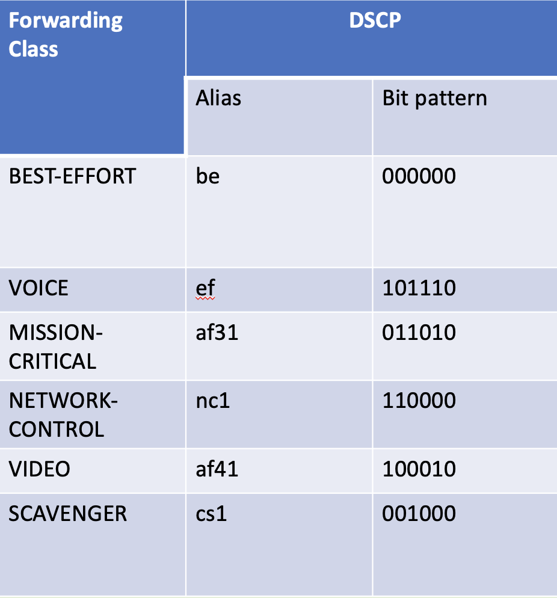
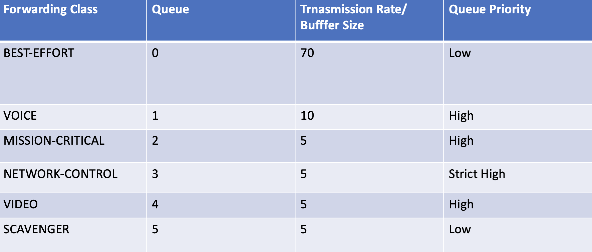

# MPLS-Backbone-Class-of-Service-Use-Case

## Use Case Requirments 
Traffic will be marked as per following by host/ servers and respective CoS treatment is required in MPLS backbone network.


## Interfaces Queue Resources 
Following queue resources is agreed.



## Mapping from DSCP to EXP Code Points 
DSCP to EXP mapping is required. 


## Lab Topology 


## Implmentation Details 
Hence marking is done at host level so on CE ingress interface we will apply behavioral aggregated classification using DSCP classifier. CE will forward IP packets by honoring DSCP marking done by host but on CE egress interfaces queues , traffic will receive required treatment i.e transmit rate and buffer size etc. Once traffic will enter ingress it will be classified using DSCP classifier and EXP rewrite rules will be applied on ingress PE egress interfaces. On LSR (P routers) EXP classifier will be applied and EXP rewrite rule will be applied. Once traffic will enter egress PEs , it will be classified using EXP classifier and egress PEs will forward traffic to egress CE. On egress CE traffic will be classified using DSCP classifier and traffic will exit towards destination host. Following config will be applie on CEs / PEs and P routers. 

```
classifiers {
    dscp CL-COS {
        import default;
        forwarding-class BEST-EFFORT {
            loss-priority low code-points be;
        }
        forwarding-class MISSION-CRITICAL {
            loss-priority low code-points af31;
        }
        forwarding-class NETWORK-CONTROL {
            loss-priority low code-points nc1;
        }
        forwarding-class SCAVENGER {
            loss-priority low code-points cs1;
        }
        forwarding-class VIDEO {
            loss-priority low code-points af41;
        }
        forwarding-class VOICE {
            loss-priority low code-points ef;
        }
    }
    exp CL-EXP-COS {
        import default;
        forwarding-class BEST-EFFORT {
            loss-priority low code-points be;
        }
        forwarding-class NETWORK-CONTROL {
            loss-priority low code-points nc1;
        }
        forwarding-class SCAVENGER {
            loss-priority low code-points be1;
        }
        forwarding-class VIDEO {
            loss-priority low code-points af11;
        }
        forwarding-class VOICE {
            loss-priority low code-points af12;
        }
    }
}
forwarding-classes {
    class BEST-EFFORT queue-num 0;
    class MISSION-CRITICAL queue-num 2;
    class NETWORK-CONTROL queue-num 3;
    class SCAVENGER queue-num 5;
    class VIDEO queue-num 4;
    class VOICE queue-num 1;
}
interfaces {
    et-* {
        scheduler-map SM-COS;
        unit * {
            classifiers {
                dscp CL-COS;
                exp CL-EXP-COS;
            }
            rewrite-rules {
                exp DSCP-EXP-REWRITE;
            }
        }
    }
    xe-* {
        scheduler-map SM-COS;
        unit * {
            classifiers {
                dscp CL-COS;
                exp CL-EXP-COS;
            }
            rewrite-rules {
                exp DSCP-EXP-REWRITE;
            }
        }
    }
    ae* {
        scheduler-map SM-COS;
        unit * {
            classifiers {
                dscp CL-COS;
                exp CL-EXP-COS;
            }
            rewrite-rules {
                exp DSCP-EXP-REWRITE;
            }
        }
    }
}
rewrite-rules {
    exp DSCP-EXP-REWRITE {
        import default;
        forwarding-class BEST-EFFORT {
            loss-priority low code-point be;
        }
        forwarding-class MISSION-CRITICAL {
            loss-priority low code-point ef1;
        }
        forwarding-class NETWORK-CONTROL {
            loss-priority low code-point nc1;
        }
        forwarding-class SCAVENGER {
            loss-priority low code-point be1;
        }
        forwarding-class VIDEO {
            loss-priority low code-point af11;
        }
        forwarding-class VOICE {
            loss-priority low code-point af12;
        }
    }
}
scheduler-maps {
    SM-COS {
        forwarding-class BEST-EFFORT scheduler SC-BEST-EFFORT;
        forwarding-class MISSION-CRITICAL scheduler SC-MISSION-CRITICAL;
        forwarding-class NETWORK-CONTROL scheduler SC-NETWORK-CONTROL;
        forwarding-class SCAVENGER scheduler SC-SCAVENGER;
        forwarding-class VIDEO scheduler SC-VIDEO;
        forwarding-class VOICE scheduler SC-VOICE;
    }
}
schedulers {
    SC-BEST-EFFORT {
        transmit-rate percent 70;
        buffer-size percent 70;
        priority low;
    }
    SC-MISSION-CRITICAL {
        transmit-rate percent 5;
        buffer-size percent 5;
        priority high;
    }
    SC-NETWORK-CONTROL {
        buffer-size percent 5;
        priority strict-high;
    }
    SC-SCAVENGER {
        transmit-rate percent 5;
        buffer-size percent 5;
        priority low;
    }
    SC-VIDEO {
        transmit-rate percent 5;
        buffer-size percent 5;
        priority high;
    }
    SC-VOICE {
        buffer-size percent 10;
        transmit-rate percent 10;
        priority high;
    }
}
```