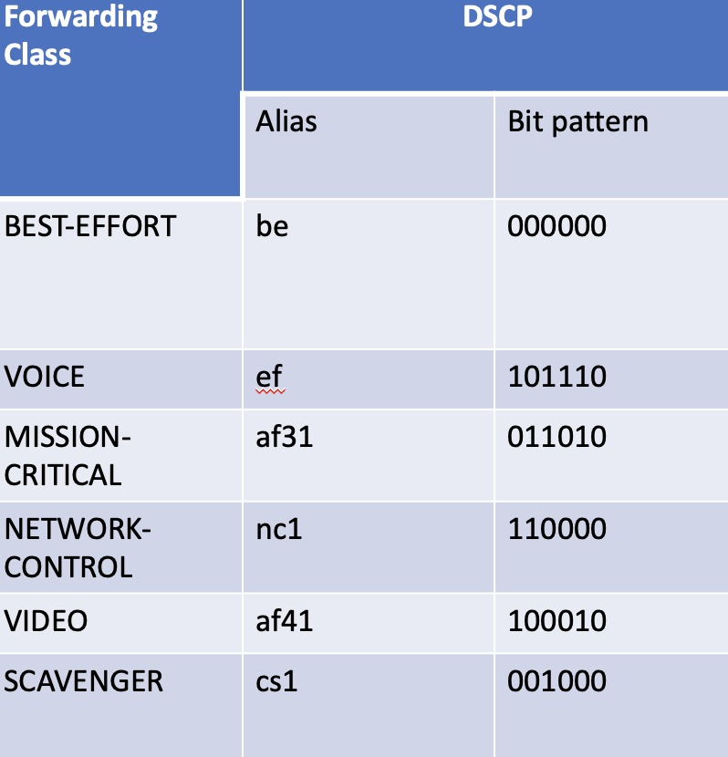

# MPLS-Backbone-Class-of-Service-Use-Case

## Use Case Requirments 
Traffic will be marked as per following by host/ servers and respective CoS treatment is required in MPLS backbone network.

## Interfaces Queue Resources 
Following queue resources is agreed.

