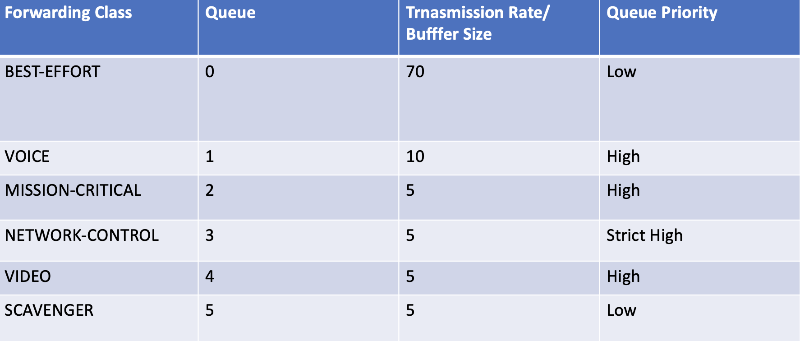

# MPLS-Backbone-Class-of-Service-Use-Case

## Reference Document 
https://github.com/kashif-nawaz/MPLS-Backbone-Class-Of-Service-Design-Principles

## Use Case Requirments 
Designing and deploying Class of Service (CoS) in an MPLS backbone network is inherently more complex than in a pure IP or switching network. In an MPLS architecture, ingress Label Switch Routers (LSRs) classify traffic by analyzing packet characteristics at ingress interfaces, utilizing either multifield classification or behavior aggregate classification. This classification enables appropriate queuing of traffic through designated forwarding queues at egress interfaces. At the egress interfaces of the ingress LSP, the EXP bits are written to ensure that transit LSRs can classify packets based on these bits and forward them through the appropriate forwarding queues. Subsequently, the EXP bits must be rewritten again so that the next LSR or egress LSR can classify packets using the EXP classifier. 

Once traffic enters the egress LSR, the MPLS label is removed, and the traffic is forwarded to the Customer Edge (CE) facing interface via IP lookup. At this stage, it may be necessary to rewrite the Differentiated Services Code Point (DSCP) bits to maintain consistent traffic classification and prioritization at the CE routers.

As mentioned above, at the ingress LSR, egress packets need to have the MPLS header's EXP bits written. At the ingress interfaces of the ingress LSR, packets may already have DSCP markings applied from a downstream network or at the host level. This raises the question of how DSCP values will be mapped to EXP bits, given that DSCP has 6 bits (allowing for 64 distinct values) while EXP has only 3 bits (which can represent 8 distinct values).

## DSCP Alias Bit pattern

| Alias     | Bit pattern|
| ----------|------------|
|  af11     | 001010     |     
|  af12     | 001100     |    
|  af13     | 001110     |   
|  af21     | 010010     |   
|  af22     | 010100     |   
|  af23     | 010110     |   
|  af31     | 011010     |   
|  af32     | 011100     |   
|  af33     | 011110     |   
|  af41     | 100010     |   
|  af42     | 100100     |   
|  af43     | 100110     |   
|  be       | 000000     |    
|  cs1      | 001000     |   
|  cs2      | 010000     |    
|  cs3      | 011000     |    
|  cs4      | 100000     |   
|  cs5      | 101000     |    
|  cs6      | 110000     |    
|  cs7      | 111000     |    
|  ef       | 101110     |    
|  nc1      | 110000     |    
|  nc2      | 111000     |

## EXP Alias Bit pattern

| Alias     | Bit pattern|
| ----------|------------|
|  af11     |   100      |     
|  af12     |   101      |      
|  be       |   000      |      
|  be1      |   001      |      
|  cs6      |   110      |      
|  cs7      |   111      |      
|  ef       |   010      |      
|  ef1      |   011      |      
|  nc1      |   110      |      
|  nc2      |   111      |


## DSCP to EXP  Bit pattern Mapping 


| DSCP Alias     | DSCP Bit pattern| EXP Alias      | EXP Bit pattern|
| ---------------|-----------------|----------------|----------------|
|  af11          | 001010          | be1            |     001        |
|  af12          | 001100          | be1            |     001        |
|  af13          | 001110          | be1            |     001        |
|  af21          | 010010          | ef             |     010        |
|  af22          | 010100          | ef             |     010        |
|  af23          | 010110          | ef             |     010        |
|  af31          | 011010          | ef1            |     011        |
|  af32          | 011100          | ef1            |     011        |
|  af33          | 011110          | ef1            |     011        |
|  af41          | 100010          | af11           |     100        |
|  af42          | 100100          | af11           |     100        |
|  af43          | 100110          | af11           |     100        |
|  be            | 000000          | be             |     000        |
|  cs1           | 001000          | be1            |     001        |
|  cs2           | 010000          | ef             |     010        |
|  cs3           | 011000          | ef1            |     011        |
|  cs4           | 100000          | ef1            |     011        |
|  cs5           | 101000          | af12           |     101        |
|  cs6           | 110000          | cs6            |     110        |
|  cs7           | 111000          | nc2            |     111        |
|  ef            | 101110          | af12           |     101        |
|  nc1           | 110000          | nc1            |     110        |
|  nc2           | 111000          | nc2            |     111        |


## Client ASK

|Forwarding Class| DSCP Alias     | DSCP Bit pattern| EXP Alias      | EXP Bit pattern|
|----------------| ---------------|-----------------|----------------|----------------|
| BE             |  be            | 000000          | be             |     000        |
| VOIP           |  ef            | 101110          | af12           |     101        |
| Critical       |  af31          | 011010          | ef1            |     011        |
| NC             |  nc1           | 110000          | nc1            |     110        |
| MM             |  af41          | 100010          | af11           |     100        |
| JUNK           |  cs1           | 001000          | be1            |     001        |


When traffic enters MPLS Backbone network from either it already have DSCP marking `

## Interfaces Queue Resources 
Following queue resources is agreed.



## Mapping from DSCP to EXP Code Points 
DSCP to EXP mapping is required. 


## Lab Topology 


## Implmentation Details 
Hence marking is done at host level so on CE ingress interface we will apply behavioral aggregated classification using DSCP classifier. CE will forward IP packets by honoring DSCP marking done by host but on CE egress interfaces queues , traffic will receive required treatment i.e transmit rate and buffer size etc. Once traffic will enter ingress it will be classified using DSCP classifier and EXP rewrite rules will be applied on ingress PE egress interfaces. On LSR (P routers) EXP classifier will be applied and EXP rewrite rule will be applied. Once traffic will enter egress PEs , it will be classified using EXP classifier and egress PEs will forward traffic to egress CE. On egress CE traffic will be classified using DSCP classifier and traffic will exit towards destination host. Following config will be applie on CEs / PEs and P routers. 

```
classifiers {
    dscp CL-COS {
        import default;
        forwarding-class BEST-EFFORT {
            loss-priority low code-points be;
        }
        forwarding-class MISSION-CRITICAL {
            loss-priority low code-points af31;
        }
        forwarding-class NETWORK-CONTROL {
            loss-priority low code-points nc1;
        }
        forwarding-class SCAVENGER {
            loss-priority low code-points cs1;
        }
        forwarding-class VIDEO {
            loss-priority low code-points af41;
        }
        forwarding-class VOICE {
            loss-priority low code-points ef;
        }
    }
    exp CL-EXP-COS {
        import default;
        forwarding-class BEST-EFFORT {
            loss-priority low code-points be;
        }
        forwarding-class NETWORK-CONTROL {
            loss-priority low code-points nc1;
        }
        forwarding-class SCAVENGER {
            loss-priority low code-points be1;
        }
        forwarding-class VIDEO {
            loss-priority low code-points af11;
        }
        forwarding-class VOICE {
            loss-priority low code-points af12;
        }
    }
}
forwarding-classes {
    class BEST-EFFORT queue-num 0;
    class MISSION-CRITICAL queue-num 2;
    class NETWORK-CONTROL queue-num 3;
    class SCAVENGER queue-num 5;
    class VIDEO queue-num 4;
    class VOICE queue-num 1;
}
interfaces {
    et-* {
        scheduler-map SM-COS;
        unit * {
            classifiers {
                dscp CL-COS;
                exp CL-EXP-COS;
            }
            rewrite-rules {
                exp DSCP-EXP-REWRITE;
            }
        }
    }
    xe-* {
        scheduler-map SM-COS;
        unit * {
            classifiers {
                dscp CL-COS;
                exp CL-EXP-COS;
            }
            rewrite-rules {
                exp DSCP-EXP-REWRITE;
            }
        }
    }
    ae* {
        scheduler-map SM-COS;
        unit * {
            classifiers {
                dscp CL-COS;
                exp CL-EXP-COS;
            }
            rewrite-rules {
                exp DSCP-EXP-REWRITE;
            }
        }
    }
}
rewrite-rules {
    exp DSCP-EXP-REWRITE {
        import default;
        forwarding-class BEST-EFFORT {
            loss-priority low code-point be;
        }
        forwarding-class MISSION-CRITICAL {
            loss-priority low code-point ef1;
        }
        forwarding-class NETWORK-CONTROL {
            loss-priority low code-point nc1;
        }
        forwarding-class SCAVENGER {
            loss-priority low code-point be1;
        }
        forwarding-class VIDEO {
            loss-priority low code-point af11;
        }
        forwarding-class VOICE {
            loss-priority low code-point af12;
        }
    }
}
scheduler-maps {
    SM-COS {
        forwarding-class BEST-EFFORT scheduler SC-BEST-EFFORT;
        forwarding-class MISSION-CRITICAL scheduler SC-MISSION-CRITICAL;
        forwarding-class NETWORK-CONTROL scheduler SC-NETWORK-CONTROL;
        forwarding-class SCAVENGER scheduler SC-SCAVENGER;
        forwarding-class VIDEO scheduler SC-VIDEO;
        forwarding-class VOICE scheduler SC-VOICE;
    }
}
schedulers {
    SC-BEST-EFFORT {
        transmit-rate percent 70;
        buffer-size percent 70;
        priority low;
    }
    SC-MISSION-CRITICAL {
        transmit-rate percent 5;
        buffer-size percent 5;
        priority high;
    }
    SC-NETWORK-CONTROL {
        buffer-size percent 5;
        priority strict-high;
    }
    SC-SCAVENGER {
        transmit-rate percent 5;
        buffer-size percent 5;
        priority low;
    }
    SC-VIDEO {
        transmit-rate percent 5;
        buffer-size percent 5;
        priority high;
    }
    SC-VOICE {
        buffer-size percent 10;
        priority high;
    }
}
```